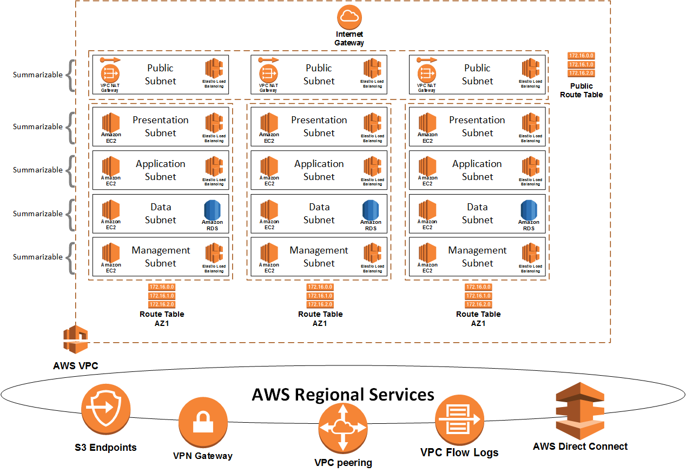

AWS VPC
=============



This module deploys an AWS VPC and all necessary components to prepare an environment for connectivity to the Internet and a Direct Connect circuit.

The goal of this project is to provide a streamlined, simple Terraform script to deploy and start running a network in AWS.


Example
------------
```
module "vpc" {
  source = "git::https://github.com/fstuck37/terraform-aws-vpc.git"
  acctnum="${var.acct-num}"
  region = "${var.region}"
  vpc-cidrs = ["${var.vpc-cidrs}"]
  name-vars = "${var.name-vars}"
  subnets = "${var.subnets}"
  subnet-order = "${var.subnet-order}"
  deploy_natgateways = true
  tags = "${var.tags}"
}

variable "acct-num" { 
  default = "1234567890123"
}

variable "region" {
  default = "us-east-1"
}
 
variable "vpc-cidrs" {
  default = ["10.0.0.0/21"]
}

variable "name-vars" {
  type = "map"
  default = {
    account = "geek37"
    name = "dev"
  }
}

variable "subnets" {
  type = "map"
  default = {
    pub = "10.0.0.0/24"
    web = "10.0.1.0/24"
    app = "10.0.2.0/24"
    db  = "10.0.3.0/24"
    mgt = "10.0.4.0/24"
  }
}

variable "subnet-order" {
  type = "list"
  default = ["pub", "web", "app", "db", "mgt"]
}

variable "tags" {
  type = "map"
  default = {
    dept = "Development"
    Billing = "12345"
    Contact = "F. Stuck"
    Environment = "POC"
    Notes  = "This is a test environment"
  }
}

```

Argument Reference
------------

* **Base Settings**
   * **region** - Required : The AWS Region to deploy the VPC to. For example us-east-1
   * **vpc-cidrs** - Required : List of CIDRs to apply to the VPC.
   * **acctnum** - Required : AWS Account Number  
   * **tags** - Optional : A map of tags to assign to the resource.  
   * **subnet-tags** - Optional : A map of maps of tags to assign to specifc subnet resource.  The key but be eamil to the key in subnets.
   * **resource-tags** - Optional : A map of maps of tags to assign to specifc resources.  The key must be one of the following: aws_vpc, aws_vpn_gateway, aws_subnet, aws_network_acl, aws_internet_gateway, aws_cloudwatch_log_group, aws_vpc_dhcp_options, aws_route_table.
   * **vpc-name** - Optional : Override the calculated VPC name (NOTE: if this is not set the VPC name will be in the format name-vars[account]-[region]-name-vars[name] for example geek37-useast1-dev.)
   * **enable_dns_support** - Optional : A boolean flag to enable/disable DNS support in the VPC. Defaults true.
   * **enable_dns_hostnames** - Optional : A boolean flag to enable/disable DNS hostnames in the VPC. Defaults false.
   * **instance_tenancy** - Optional : A tenancy option for instances launched into the VPC.
   * **name-vars** - Required : Map with two keys account and name. Names of elements are created based on these values.
   ```
   variable "name-vars" {
     type = map(string)
     default = {
       account = "geek37"
       name = "dev"
     }
   }
   ```
   * **zones** - Optional : Map of AWS zones with a value equal to a list of the availability zones in the region. Each of the AZs listed are utilized for the VPC.
* **Subnet Information**
   * **subnets** - Optional : Keys are used for subnet names and values are the subnets for the various layers. These will be divided by the number of AZs based on ceil(log(length(var.zones[var.region]),2)). 'pub' is the only special name used for the public subnet.
   ```
   variable "subnets" {
     type = "map"
     default = {
       pub = "10.0.0.0/24"
       web = "10.0.1.0/24"
       app = "10.0.2.0/24"
       db  = "10.0.3.0/24"
       mgt = "10.0.4.0/24"
     }
   }
   ```
   * **subnet-order** - Required : Order in which subnets are created. The default is to use the keys function which sorts lexically. This can cause recreation issues when subnets are added when something lexically precedes existing subnets. Must include all key names and if utilized 'pub' must be specified first.
   ```
   variable "subnet-order" {
     type = "list"
     default = ["pub", "web", "app", "db", "mgt"]
   }
   ```
* **Route53 Options**
   * **default_reverse_zones** - Optional : Deploy Route53 Reverse Lookup Zones as /24s. Defaults to false
   * **shared_resolver_rule** - Optional : Deploy Route53 resolver rules. Defaults to false
   * **route53_resolver_endpoint** - Optional : A boolean flag to enable/disable Route53 Resolver Endpoint. Defaults false.
   * **route53_resolver_endpoint_cidr_blocks** - Optional : A list of the source CIDR blocks to allow to commuicate with the Route53 Resolver Endpoint. Defaults 0.0.0.0/0.
   * **route53_resolver_endpoint_subnet** - Optional : The subnet to install Route53 Resolver Endpoint , the default is mgt but must exist as a key in the variable subnets.
* **DHCP Options**
   * **domain_name** - Optional : DNS search domains for DHCP Options
   * **domain_name_servers** - Optional : DNS Servers for DHCP Options
   * **ntp_servers** - Optional : NTP Servers for DHCP Options
* **Network ACL Variables**
   * **bypass_ingress_rules** - Optional : Permit ingress Source|Port or Source|StartPort-EndPort for example 10.0.0.0/8|22 or 10.0.0.0/8|20-21
   * **bypass_egress_rules** - Optional : Permit egress Source|Port or Source|StartPort-EndPort for example 10.0.0.0/8|22 or 10.0.0.0/8|20-21
   * **block_ports** - Optional : Ports to block both inbound and outbound
   * **ingress_block** - Optional : CIDR blocks to block inbound
   * **egress_block** - Optional : CIDR blocks to block outbound
* **DxGW, NAT Gateway, Endpoints, and Peer Links**
   * **dx_bgp_default_route** - Optional : A boolean flag that indicates that the default gateway will be advertised via BGP over Direct Connect and causes the script to not deploy NAT Gateways.
   * **dx_gateway_id** - Optional : specify the Direct Connect Gateway ID to associate the VGW with.
   * **enable-s3-endpoint** - Optional : Enable the S3 Endpoint, default is false
   * **enable-dynamodb-endpoint** - Optional : Enable the DynamoDB Endpoint, default is false
   * **private_endpoints** - Optional : List of Maps for private AWS Endpoints - <REGION> will be replace with the region of the VPC. This helps standardize inputs between VPCs for example you can send com.amazonaws.<REGION>.cloudformation for a cloudformation endpoint. The keys for the maps are as follows: name[Name of Resource], subnet[Name of the subnet group for the Endpoint], service[<REGION> will be replace with the region of the VPC.], security_group[sgid of the sg to apply, if more than one is needed they should be | delimited]
IE:
variable "private_endpoints" {
  description = "List of Maps for private AWS Endpoints Keys for Map are name[Name of Resource], subnet[Name of the subnet group for the Endpoint], service[<REGION> will be replace with the region of the VPC.], security_group[sgid of the sg to apply, if more than one is needed they should be | delimited].
    ```
    variable "private_endpoints" {
     default = [
        {
            name = "storage-gateway-endpoint"
            subnet = "mgt" 
            service = "com.amazonaws.<REGION>.storagegateway"
            security_group = "sg-123456789"
        },
        {
            name = "execute-api-endpoint"
            subnet = "app"
            service = "com.amazonaws.<REGION>.execute-api"
            security_group = "sg-123456789"
        }
      ]
    }
    ```
   * **deploy_natgateways** - Optional : Set to true to deploy NAT gateways if pub subnet is created
   * **peer_requester** - Optional : Map of Peer Link Name with a value of [Peer AWS Account Number]|[Peer VPC_ID]|[Peer VPC CIDR]|[allow_remote_vpc_dns_resolution]. This only creates the requester half of the connection. Since maps our lexically prepend the VPC name with a alpha character so they flow alphabetically, for example a-peerlink1, b-peerlink2, etc.
   ```
   variable "peer_requester" {
     type = "map"
     default = {
       a_dev2 = "1234567890123|vpc-0c23f7846a96a4723|10.1.0.0/21|true"
     }
   }
   ```
   * **peer_accepter** - Optional : Map of Peer Link Name with a value of [vpc_peering_connection_id]|[Peer VPC CIDR]. This only creates the accepter half of the connection. Since maps our lexically prepend the VPC name with a alpha character so they flow alphabetically, for example a-peerlink1, b-peerlink2, etc.
   ```
   variable "peer_accepter" {
     type = "map"
     default = {
       a_dev1 = "pcx-07be323735e1a8436|10.0.0.0/20"
     }
   }
   ```
* **VPC Flow Logs**
   * **enable_flowlog** - Optional : A boolean flag to enable/disable VPC flowlogs.
   * **aws_lambda_function_name** - Optional : Lambda function name to call when sending to logs to an external SEIM.
   * **flow_log_filter** - CloudWatch subscription filter to match flow logs.
   * **cloudwatch_retention_in_days** - Optional : Number of days to keep logs within the cloudwatch log_group. The default is 7 days.

Notes and Workarounds
------------
A workaround to deleting subnets or peer links.
terraform state mv <resource-name>.<resource-id>[<i>] <resource-name>.<resource-id>[<j>] 
Move elements one at a time in the list, upwards or downwards depending on the v5alues you set for i & j.

Output Reference
------------
   * **vpc_id** - VPC ID Number
   * **vpc_name** - VPC Name
   * **subnet_ids** - Map where the keys are the subnet names and the values are the subnet IDs
   * **map_subnet_id_list** - Map where the keys come from subnet-order and the values are a list of the subnet IDs in each availability zone.
   * **pubrt_id** - The public subnet router IDs
   * **privrt_id** - List of the private router subnet IDs
   * **vgw_id** - The ID of the VGW
   * **peerlink_ids** - Map where the keys are the peerlink names and the values are the peerlink IDs
